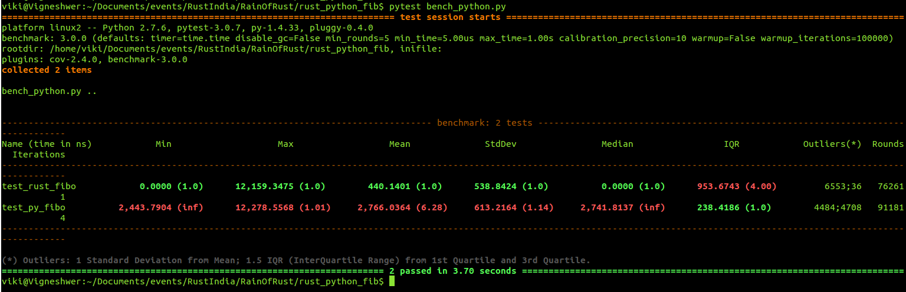
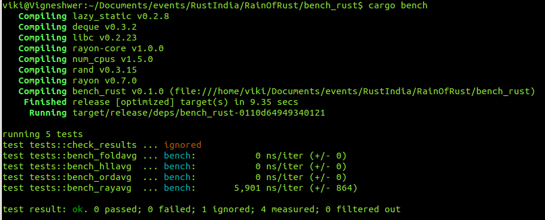

# RainofRust Campaign Kit

Rust is a state of art programming language for the modern day applications, which runs blazingly fast, prevents segfaults, and guarantees thread safety.

## Main Aims:

RainofRust campaign aims at the following aspects:

* Creating more awareness about Rust language across the students and developer communities
* Inspire local Rust mobilizers to start regional user groups
* Cruating workshop kit to produce tangible outputs as deliverables of the event
* Use the existing communication channels to support Rust community members

### Goals and Scope:

* 30 Rust events (online/offline) in the month of June 2017
* Collaborate with Tech Speakers
* Reach to 500 Rust users
* Introduce Rust to students and professionals/developers

## Host an event 

Interested to host an event in your city, please follow the instructions below:

1. Get your event listed in the [Reps portal](https://reps.mozilla.org/):
  * Contact a [Mozilla representative](https://reps.mozilla.org/people/#/) near you to get your event listed under the [MozActivate](https://activate.mozilla.community/) category
  * Read the [Mozactivate event guide](https://activate.mozilla.community/eventguide/) and [FAQ](https://activate.mozilla.community/faq/) to setup the event in your city
2. Create an [issue](https://github.com/MozillaIndia/RustIndia/issues) in the following manner:

~~~~
## Name of the Event
(Rust Hackday @ABC city)

### Location 
(ABC city)

### Event Link
(Reps portal link)

### Expected Participants and profile

100 people
* 50 web developers
* 30 Students
* 20 Business professionals

### Links to pictures
Flickr /Google photos

### Agenda of the event

* Introductory event covering
  * Installation of Rust compiler
  * Playing with Cargo
  * Creating your first Rust program
  * Exploring common data structure 

### Speaker details

Mozilla TechSpeaker xyz addressed the event
~~~~

3. Use the [feedback form](http://mzl.la/howwasit) to report the how the event went

## Community Support 

Above are the standard ways to get your events listed we have other support channels to help you,

* Not able to find an Rep drop a message in [Rust India telegram Group channel](https://t.me/joinchat/AAAAAEFQaXicCPeaeVIm_Q)

For any other doubts regarding any aspect please feel free to raise questions/feedbacks in the community telegram group.

## Resource materials

Below are the general Rust kits for introductary events:

* [Main community Repo](https://github.com/MozillaIndia/RustIndia) for working open and collabratively

* [Starter kit (ideal for lightning talks)](https://github.com/MozillaTN/Rust/tree/master/short_demo)

* [Workshop Kit (ideal for 2-3 hours session)](https://github.com/MozillaTN/Rust/tree/master/long_demo)

* [Basic Terminology](https://dvigneshwer.wordpress.com/2017/02/25/unraveling-rust-design/)

* Slides: 
  * [Workshop slide material](https://dvigneshwer.github.io/files/Deep_drive_into_Rust_programming_language.pdf)
  * [Detailed Explanation](https://dvigneshwer.github.io/talks/2012-03-01-talk-1)
  * [Rust introduction](http://angrylawyer.github.io/a-dabblers-adventures-in-rust/#slide1)

* [Rust Video playlist](https://www.youtube.com/playlist?list=PLLYM4qs6CxRAudbyqZw14ksNNmCfuZ_JS)

* [Rust learning resources](https://github.com/ctjhoa/rust-learning/)

* [RustBridge events](https://github.com/rust-community/rustbridge)

## Rust Kits

### Advance Rust events 

These events are focussed at building tangible outputs at end of the day:

* Rust-python binding
  * Creating a python module in Rust which focusses on delivering high performance 
  * [Code](./rust_python_fib)
  * Read the documentation [here](https://dvigneshwer.github.io/posts/2016/04/Rust-Python/)

* Benchamrking Rust 
  * Learn to benchmark different functional units of a Rust program
  * [Code](./bench_rust)

* Web development in Rust
  * Activity focusses on web development using Rust
  * [Code](./rust-users)
  * Read the documentation [here](https://dvigneshwer.github.io/posts/2017/05/Rust-web-dev/)

* Web assembly activites
  * WebAssembly or wasm is a new portable, size- and load-time-efficient format suitable for compilation to the web
  * [Documentation](http://webassembly.org/)

* Servo project experiments
  * Try out the experiments listed in the website and benchmark performance
  * [Documentation](https://www.servoexperiments.com/)
  * [Contribute to Servo bugs](https://starters.servo.org/)

* Contribute to whitepaper on benchmarking Rust  
  * Select an [issue](https://github.com/dvigneshwer/Benchmarking_Rust/issues) and publish your result

## Code of conduct 

Please follow the code of conduct listed [here](/code_of_conduct.md) in your events. 
